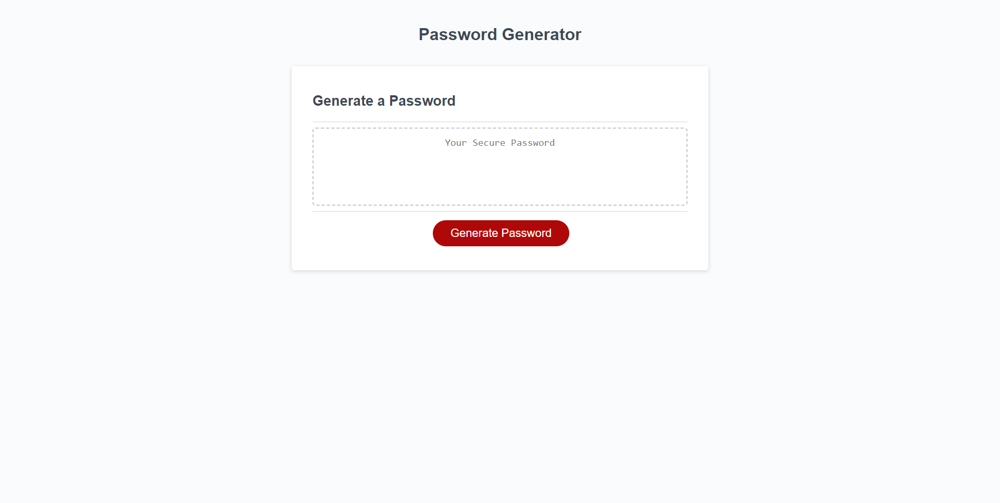

# password-generator

## Description

- Had to make a password generator that could take inputs and spit out a random based on the inputs.
- Actually a good way to get random passwords.
- This project was good practice for beccomming familiar with JS.

## Table of Contents (Optional)

- [Usage](#usage)
- [Credits](#credits)
- [License](#license)

## Usage

Press the "Generate Password" button and follow the prompts. The password must be between 8-128 characters.

  

Deployed Application
  https://danieljutila.github.io/password-generator/

## Credits

Brother in law, Called him up because my code looked messy. He said I could clean up a lot of code by looping through the object. Helped me not DRY code

Got me on my way for getting for-loop working with object. 
- https://developer.mozilla.org/en-US/docs/Web/JavaScript/Reference/Statements/for...in

## License

MIT License

Copyright (c) [2023] [Daniel Jutila]

Permission is hereby granted, free of charge, to any person obtaining a copy
of this software and associated documentation files (the "Software"), to deal
in the Software without restriction, including without limitation the rights
to use, copy, modify, merge, publish, distribute, sublicense, and/or sell
copies of the Software, and to permit persons to whom the Software is
furnished to do so, subject to the following conditions:

The above copyright notice and this permission notice shall be included in all
copies or substantial portions of the Software.

THE SOFTWARE IS PROVIDED "AS IS", WITHOUT WARRANTY OF ANY KIND, EXPRESS OR
IMPLIED, INCLUDING BUT NOT LIMITED TO THE WARRANTIES OF MERCHANTABILITY,
FITNESS FOR A PARTICULAR PURPOSE AND NONINFRINGEMENT. IN NO EVENT SHALL THE
AUTHORS OR COPYRIGHT HOLDERS BE LIABLE FOR ANY CLAIM, DAMAGES OR OTHER
LIABILITY, WHETHER IN AN ACTION OF CONTRACT, TORT OR OTHERWISE, ARISING FROM,
OUT OF OR IN CONNECTION WITH THE SOFTWARE OR THE USE OR OTHER DEALINGS IN THE
SOFTWARE.
